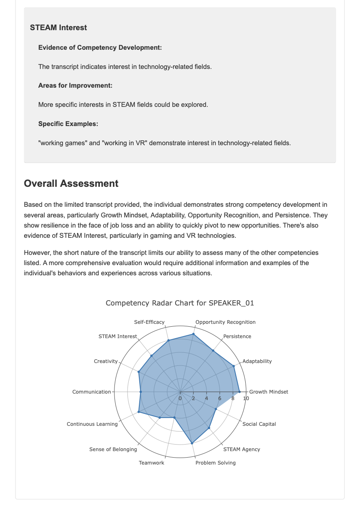

# TPZ Competency Analyzer

A TPZ-specific adaptation that combines ZoneSight and Portfolio Analyzer to extract competency insights across 14 key TPZ dimensions, combining local processing with cloud services.

## Table of Contents
- [Overview](#overview)
- [Components](#components)
- [Features](#features)
- [Installation](#installation)
- [Usage](#usage)
  - [Running ZoneSight: Three Approaches](#running-zonesight-three-approaches)
    - [1. GUI Version](#1-gui-version-zonesight_guipy)
      - [Audio Reflection Interface](#audio-reflection-interface)
      - [Portfolio Interface](#portfolio-interface)
    - [2. Interactive Command Line](#2-interactive-command-line-mainpy)
    - [3. JAM Command](#3-jam-command-advanced-cli)
- [Output](#output)
  - [Audio Analysis Output](#audio-analysis-output)
  - [Portfolio Analysis Output](#portfolio-analysis-output)
  - [Directory Structure](#directory-structure)
- [LLM Provider](#llm-provider)
- [System Requirements](#system-requirements)
- [Troubleshooting](#troubleshooting)

## Overview

ZoneSight analyzes both audio recordings and student portfolios to extract competency insights, providing detailed reports on 14 key competency dimensions. The tool combines local processing with cloud services:

- For audio analysis: Local transcription with cloud-based speaker diarization and competency analysis
- For portfolio analysis: Web page conversion to PDF and cloud-based competency analysis

## Components

### Local Processing
- **Transcription**: Uses OpenAI's Whisper locally (no API key needed)
  - Runs completely offline
  - Uses local GPU/CPU for processing
  - Supports multiple languages
  - Downloads model files on first use (~1.5GB for medium model)

### Cloud Services Required
1. **Speaker Diarization**: Uses pyannote.audio (requires Hugging Face token)
   - Requires accepting model terms of use at huggingface.co
   - Needs HUGGING_FACE_TOKEN in .env

2. **HTML-to-PDF Conversion**: Uses an external service for portfolio analysis
   - Converts Google Sites pages to PDF for analysis
   - Needs PDF_HOST in .env (defaults to https://html2pdf-u707.onrender.com)

3. **Competency Analysis**: Uses OpenRouter API (requires API key)
   - Analyzes transcripts and portfolio content against competency framework
   - Generates ratings and insights
   - Needs OPENROUTER_API_KEY and related settings in .env

## Features

Analyzes 14 key competencies (see full definitions and RDs in test_full.rtf in working folder, or consult TPZ documentation):
1. Sense of Belonging - Feeling connected to a learning community
2. Growth Mindset - Belief that abilities can grow with effort
3. STEAM Interest - Exploration of identity through STEAM
4. Creativity - Ability to generate and adapt ideas
5. Communication - Clear exchange of information
6. Teamwork - Cooperative work with diverse peers
7. Adaptability - Adjusting to change and uncertainty
8. Problem-Solving - Identifying and solving challenges
9. STEAM Agency - Capability with STEAM tools
10. Self-Efficacy - Confidence in ability to succeed
11. Persistence - Sustaining effort through challenges
12. Opportunity Recognition - Identifying learning opportunities
13. Continuous Learning - Ongoing skill development
14. Social Capital - Building and leveraging connections

Each competency is evaluated on a 1-10 scale across three levels:
- Emerging (1-3)
- Developing (4-7)
- Proficient (8-10)

## Quick Start

1. Ensure you have **Python 3.11+** installed (tested with Python 3.11.11)
2. Clone the repository
3. Set up a virtual environment and install dependencies:
   ```bash
   # Create a virtual environment
   python3.11 -m venv venv
   
   # Activate the virtual environment
   # On Windows:
   venv\Scripts\activate
   # On macOS/Linux:
   source venv/bin/activate
   
   # Install dependencies
   pip install -r requirements.txt
   ```
4. Create a `.env` file with your API keys (see Environment Variables section)
5. Run the GUI: `python src/zonesight_gui.py`

## Installation

### Prerequisites
- **Python 3.11+** (specifically tested with Python 3.11.11)
- FFmpeg (for audio processing)
- Internet connection (for API services)
- GPU recommended but not required (for faster transcription)

### Step-by-Step Installation

1. Clone the repository:
   ```bash
   git clone https://github.com/TPZgus/ZoneSight.git
   cd Zonesight
   ```

2. Create and activate a virtual environment:
   ```bash
   # Create a virtual environment
   python3.11 -m venv venv
   
   # Activate the virtual environment
   # On Windows:
   venv\Scripts\activate
   # On macOS/Linux:
   source venv/bin/activate
   ```

3. Install dependencies:
   ```bash
   pip install -r requirements.txt
   ```
   
   Note: On some systems, you may need to install additional system packages for certain dependencies:
   - For pygame on Linux: `sudo apt-get install python3-pygame`
   - For tk on Linux: `sudo apt-get install python3-tk`

4. Create a `.env` file in the root directory with the following environment variables:
   ```
   # For Competency Analysis (OpenRouter)
   OPENROUTER_API_KEY=your_key_here
   OPENROUTER_URL=https://openrouter.ai/api/v1/chat/completions
   OPENROUTER_MODEL=anthropic/claude-3.7-sonnet

   # For Speaker Diarization (Hugging Face)
   HUGGING_FACE_TOKEN=your_token_here
   
   # For Portfolio Analysis (HTML-to-PDF)
   PDF_HOST=https://html2pdf-u707.onrender.com
   ```

5. Ensure required sound files are in the root directory:
   - sound.mp3 (completion sound)
   - coin.mp3 (progress indicator)
   - In the Zone.mp3 (background music)
   - ZoneSight_banner_tpz.png (for GUI header)

### Obtaining API Keys

- **OpenRouter API Key**: Sign up at [openrouter.ai](https://openrouter.ai) and create an API key
- **Hugging Face Token**: Create an account at [huggingface.co](https://huggingface.co), then generate a token in your account settings
  - You'll also need to accept the terms for the pyannote/speaker-diarization model at [huggingface.co/pyannote/speaker-diarization](https://huggingface.co/pyannote/speaker-diarization)

## Usage

ZoneSight can be run in three ways:

1.  **Gradio Web Interface (Recommended)**: A user-friendly, web-based interface for analyzing audio files.
2.  **Interactive Command Line**: A text-based interface for audio analysis.
3.  **JAM Command**: An advanced CLI for power users.

### 1. Gradio Web Interface (`src/app.py`)

This is the recommended way to use ZoneSight. The Gradio app provides a simple interface to upload your audio and competency files and view the analysis results directly in your browser.

**To run the Gradio app:**

```bash
python src/app.py
```

This will start a local web server. Open the URL provided in the terminal (usually `http://127.0.0.1:7860`) to access the application.

**Features:**
-   **File Upload**: Easily upload your audio file (e.g., WAV, MP3) and competency definition file (TXT or RTF).
-   **Interactive Report**: View the HTML analysis report directly in an embedded iframe.
-   **JSON Data**: Access the raw JSON output for further processing or integration.

### 2. Interactive Command Line (`src/main.py`)

The original command-line interface is still available for audio analysis.

**To run in interactive mode:**

```bash
python src/main.py
```

The script will prompt you to enter the paths to your audio and competency files.

### 3. JAM Command (Advanced CLI)

The `jam` command provides a streamlined, non-interactive way to run analyses, suitable for scripting and automation.

**To use the JAM command:**

```bash
python src/jam.py --audio <path_to_audio> --competencies <path_to_competencies>
```

## Output

The tool generates different outputs depending on the analysis type:

### Audio Analysis Output
1. Transcription files (before and after diarization)
2. HTML report with:
   - Competency ratings (1-10 scale)
   - Evidence for each rating
   - Interactive radar charts for competency visualization
   - Separate sections for each speaker (if diarization enabled)



3. Structured JSON output:
   - Machine-readable format for data analysis
   - Contains all competency ratings and evidence
   - Can be integrated with research and evaluation tools
   - Adaptable for custom data processing workflows

### Portfolio Analysis Output
1. HTML report with:
   - Competency ratings (1-10 scale)
   - Evidence for each rating
   - Areas for improvement
   - Interactive radar charts for competency visualization
   - Examples from the portfolio
2. Structured JSON output:
   - Machine-readable format for data analysis
   - Contains all competency ratings and evidence
   - Can be integrated with research and evaluation tools
   - Adaptable for custom data processing workflows

### Directory Structure
- `results/` - Contains all output files
  - `transcript_*_before_diarization_*.txt` - Raw transcripts
  - `transcript_*_after_diarization_*.txt` - Speaker-labeled transcripts
  - `combined_report_*.html` - Audio analysis reports
  - `portfolio_report_*.html` - Portfolio analysis reports
  - `structured_data_*.json` - Audio analysis JSON data
  - `portfolio_data_*.json` - Portfolio analysis JSON data
- `temp/` - Temporary audio chunks (auto-cleaned after processing)

## LLM Provider

ZoneSight currently uses OpenRouter as the LLM provider for competency analysis. The default model is `anthropic/claude-3.7-sonnet`, but this can be changed in your .env file.

### Using Alternative LLM Providers

The code can be modified to use other LLM providers by:

1. Updating the `extract_competency_insights` function in `src/main.py`
2. Modifying the API endpoint, headers, and request format to match your preferred provider
3. Updating the environment variables accordingly

For example, to use Amazon Bedrock directly instead of OpenRouter, you would need to:
- Change the API endpoint to Amazon Bedrock's endpoint
- Update the authentication method to use AWS credentials
- Adjust the request format to match Amazon Bedrock's API requirements
- Configure the appropriate region and service settings

## System Requirements

- **Python 3.11+** (specifically tested with Python 3.11.11)
- FFmpeg (for audio processing)
- Internet connection (for diarization and competency analysis)
- Disk space: ~2GB for model files and dependencies
- Memory: At least 4GB RAM recommended (8GB+ for larger audio files)
- GPU: Optional but recommended for faster transcription
- **macOS-specific**: pyobjc-framework-Cocoa package for AppKit module (automatically installed via requirements.txt)

## Troubleshooting

### Virtual Environment Issues
- If you encounter issues with the virtual environment, try creating it with the specific Python version:
  ```bash
  python3.11 -m venv venv
  ```
- On Windows, you may need to enable script execution:
  ```powershell
  Set-ExecutionPolicy -ExecutionPolicy RemoteSigned -Scope CurrentUser
  ```

### Speaker Diarization Issues
- Ensure you've accepted the model terms at huggingface.co
- Verify your Hugging Face token is correct in the .env file
- Try running `huggingface-cli login` in your terminal

### Transcription Issues
- Check that FFmpeg is installed and accessible in your PATH
- Ensure audio files are in a supported format
- For large files, the system will automatically
