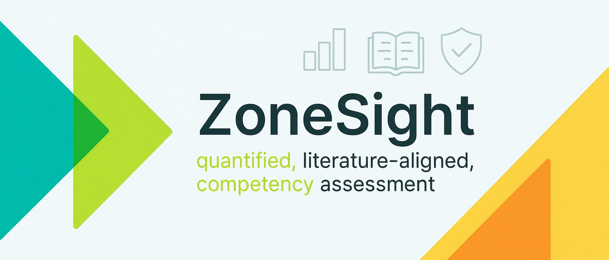

# TPZ Competency Analyzer

A TPZ-specific adaptation that combines ZoneSight and Portfolio Analyzer to extract competency insights across 14 key TPZ dimensions, combining local processing with cloud services.

## Table of Contents
- [Overview](#overview)
- [Components](#components)
- [Features](#features)
- [Installation](#installation)
- [Usage](#usage)
  - [Running ZoneSight: Three Approaches](#running-zonesight-three-approaches)
    - [1. GUI Version](#1-gui-version-zonesight_guipy)
      - [Audio Reflection Interface](#audio-reflection-interface)
      - [Portfolio Interface](#portfolio-interface)
    - [2. Interactive Command Line](#2-interactive-command-line-mainpy)
    - [3. JAM Command](#3-jam-command-advanced-cli)
- [Output](#output)
  - [Audio Analysis Output](#audio-analysis-output)
  - [Portfolio Analysis Output](#portfolio-analysis-output)
  - [Directory Structure](#directory-structure)
- [LLM Provider](#llm-provider)
- [System Requirements](#system-requirements)
- [Troubleshooting](#troubleshooting)

## Overview

ZoneSight analyzes both audio recordings and student portfolios to extract competency insights, providing detailed reports on 14 key competency dimensions. The tool combines local processing with cloud services:

- For audio analysis: Local transcription with cloud-based speaker diarization and competency analysis
- For portfolio analysis: Web page conversion to PDF and cloud-based competency analysis

## Components

### Local Processing
- **Transcription**: Uses OpenAI's Whisper locally (no API key needed)
  - Runs completely offline
  - Uses local GPU/CPU for processing
  - Supports multiple languages
  - Downloads model files on first use (~1.5GB for medium model)

### Cloud Services Required
1. **Speaker Diarization**: Uses pyannote.audio (requires Hugging Face token)
   - Requires accepting model terms of use at huggingface.co
   - Needs HUGGING_FACE_TOKEN in .env

2. **HTML-to-PDF Conversion**: Uses an external service for portfolio analysis
   - Converts Google Sites pages to PDF for analysis
   - Needs PDF_HOST in .env (defaults to https://html2pdf-u707.onrender.com)

3. **Competency Analysis**: Uses OpenRouter API (requires API key)
   - Analyzes transcripts and portfolio content against competency framework
   - Generates ratings and insights
   - Needs OPENROUTER_API_KEY and related settings in .env

## Features

Analyzes 14 key competencies (see full definitions and RDs in test_full.rtf in working folder, or consult TPZ documentation):
1. Sense of Belonging - Feeling connected to a learning community
2. Growth Mindset - Belief that abilities can grow with effort
3. STEAM Interest - Exploration of identity through STEAM
4. Creativity - Ability to generate and adapt ideas
5. Communication - Clear exchange of information
6. Teamwork - Cooperative work with diverse peers
7. Adaptability - Adjusting to change and uncertainty
8. Problem-Solving - Identifying and solving challenges
9. STEAM Agency - Capability with STEAM tools
10. Self-Efficacy - Confidence in ability to succeed
11. Persistence - Sustaining effort through challenges
12. Opportunity Recognition - Identifying learning opportunities
13. Continuous Learning - Ongoing skill development
14. Social Capital - Building and leveraging connections

Each competency is evaluated on a 1-10 scale across three levels:
- Emerging (1-3)
- Developing (4-7)
- Proficient (8-10)

## Quick Start

1. Ensure you have **Python 3.11+** installed (tested with Python 3.11.11)
2. Clone the repository
3. Set up a virtual environment and install dependencies:
   ```bash
   # Create a virtual environment
   python3.11 -m venv venv
   
   # Activate the virtual environment
   # On Windows:
   venv\Scripts\activate
   # On macOS/Linux:
   source venv/bin/activate
   
   # Install dependencies
   pip install -r requirements.txt
   ```
4. Create a `.env` file with your API keys (see Environment Variables section)
5. Run the GUI: `python src/zonesight_gui.py`

## Installation

### Prerequisites
- **Python 3.11+** (specifically tested with Python 3.11.11)
- FFmpeg (for audio processing)
- Internet connection (for API services)
- GPU recommended but not required (for faster transcription)

### Step-by-Step Installation

1. Clone the repository:
   ```bash
   git clone https://github.com/yourusername/zonesight.git
   cd zonesight
   ```

2. Create and activate a virtual environment:
   ```bash
   # Create a virtual environment
   python3.11 -m venv venv
   
   # Activate the virtual environment
   # On Windows:
   venv\Scripts\activate
   # On macOS/Linux:
   source venv/bin/activate
   ```

3. Install dependencies:
   ```bash
   pip install -r requirements.txt
   ```
   
   Note: On some systems, you may need to install additional system packages for certain dependencies:
   - For pygame on Linux: `sudo apt-get install python3-pygame`
   - For tk on Linux: `sudo apt-get install python3-tk`

4. Create a `.env` file in the root directory with the following environment variables:
   ```
   # For Competency Analysis (OpenRouter)
   OPENROUTER_API_KEY=your_key_here
   OPENROUTER_URL=https://openrouter.ai/api/v1/chat/completions
   OPENROUTER_MODEL=anthropic/claude-3.7-sonnet

   # For Speaker Diarization (Hugging Face)
   HUGGING_FACE_TOKEN=your_token_here
   
   # For Portfolio Analysis (HTML-to-PDF)
   PDF_HOST=https://html2pdf-u707.onrender.com
   ```

5. Ensure required sound files are in the root directory:
   - sound.mp3 (completion sound)
   - coin.mp3 (progress indicator)
   - In the Zone.mp3 (background music)
   - ZoneSight_banner_tpz.png (for GUI header)

### Obtaining API Keys

- **OpenRouter API Key**: Sign up at [openrouter.ai](https://openrouter.ai) and create an API key
- **Hugging Face Token**: Create an account at [huggingface.co](https://huggingface.co), then generate a token in your account settings
  - You'll also need to accept the terms for the pyannote/speaker-diarization model at [huggingface.co/pyannote/speaker-diarization](https://huggingface.co/pyannote/speaker-diarization)

## Usage

## Running ZoneSight: Three Approaches

ZoneSight offers three different ways to run the application, each with its own advantages. Choose the approach that best fits your workflow and requirements.

### 1. GUI Version (zonesight_gui.py)

```bash
python src/zonesight_gui.py
```

**When to use:** For interactive, user-friendly analysis with visual feedback.

**Advantages:**
- Intuitive graphical interface with visual progress tracking
- Easy file selection via browse dialogs
- Interactive settings and options
- Real-time status updates and progress indicators
- Ability to switch between analysis types without restarting
- Visual representation of the analysis process

The GUI provides a landing page with three options:
- **Audio Reflection** - For analyzing audio recordings
- **Portfolio** - For analyzing student portfolios
- **Video Performance of Learning** - Placeholder for future implementation

#### Audio Reflection Interface
- Simplified audio file selection showing file count and names
- Competency file selection (RTF/TXT)
- Optional speaker diarization
- Background music toggle (disabled by default)
- Output format selection:
  - Full Report (HTML with narrative and ratings)
  - Structured JSON (machine-readable format)
  - Both (generates both formats)
- Progress tracking
- Automatic report generation for each audio file

#### Portfolio Interface
- Direct portfolio URL input for single portfolio analysis
- CSV file upload option for batch processing multiple portfolios
- Portfolio section selection:
  - Beginner, Intermediate, Advanced skill levels
  - Business and Resume sections
- Background music toggle (disabled by default)
- Output format selection (same options as Audio Reflection)
- Progress tracking
- Automatic report generation for each portfolio

### 2. Interactive Command Line (main.py)

```bash
python src/main.py
```

**When to use:** For simple, guided analysis through terminal prompts.

**Advantages:**
- Step-by-step guided process with clear prompts
- Lightweight and works in terminal-only environments
- Simpler for single-file processing
- Minimal dependencies for the interface
- Useful for direct interaction without a GUI
- Colorful terminal output with progress indicators

This mode walks you through the analysis process with interactive prompts:
1. Asks for the audio file path
2. Prompts for the competency file path
3. Asks if you want to perform diarization
4. Processes the audio and generates reports
5. Provides colorful terminal output with progress updates

### 3. JAM Command (Advanced CLI)

```bash
# Using the JAM script directly
./JAM --type a --output both --diarization audio_file.mp3

# Or using the Python script
python src/jam.py --type a --output both --diarization audio_file.mp3
```

**When to use:** For batch processing, automation, and integration with other tools.

**Advantages:**
- Powerful batch processing capabilities
- Scriptable for automation and integration
- CSV input support for bulk analysis
- Flexible command-line arguments
- Perfect for integration with other tools and workflows
- Ideal for scheduled tasks and automated processing

The JAM command provides a comprehensive command-line interface with various options:

**Required arguments:**
- `--type` or `-t`: Type of analysis to perform
  - `a` or `audio`: Audio reflection analysis
  - `p` or `portfolio`: Portfolio analysis
  - `v` or `video`: Video performance analysis (placeholder)

**Optional arguments:**
- `--output` or `-o`: Output format (default: both)
  - `json`: Generate JSON output only
  - `html`: Generate HTML report only
  - `both`: Generate both formats
- `--competency` or `-c`: Path to competency file (default: test_full.rtf)
- `--diarization` or `-d`: Enable speaker diarization for audio (flag)
- `--csv`: CSV file containing input files or URLs (one per line)

**Examples:**
```bash
# Analyze audio with diarization, output both formats
./JAM --type a --output both --diarization audio_file.mp3

# Analyze multiple audio files
./JAM --type a audio1.mp3 audio2.mp3 audio3.mp3

# Analyze portfolio with custom competency file
./JAM --type p --competency custom_competencies.rtf https://portfolio-url.com

# Analyze inputs from a CSV file
./JAM --type a --csv inputs.csv
```

For full help and options:
```bash
./JAM --help
```

## Output

The tool generates different outputs depending on the analysis type:

### Audio Analysis Output
1. Transcription files (before and after diarization)
2. HTML report with:
   - Competency ratings (1-10 scale)
   - Evidence for each rating
   - Interactive radar charts for competency visualization
   - Separate sections for each speaker (if diarization enabled)
3. Optional structured JSON output

### Portfolio Analysis Output
1. HTML report with:
   - Competency ratings (1-10 scale)
   - Evidence for each rating
   - Areas for improvement
   - Interactive radar charts for competency visualization
   - Examples from the portfolio
2. Optional structured JSON output

### Directory Structure
- `results/` - Contains all output files
  - `transcript_*_before_diarization_*.txt` - Raw transcripts
  - `transcript_*_after_diarization_*.txt` - Speaker-labeled transcripts
  - `combined_report_*.html` - Audio analysis reports
  - `portfolio_report_*.html` - Portfolio analysis reports
  - `structured_data_*.json` - Audio analysis JSON data
  - `portfolio_data_*.json` - Portfolio analysis JSON data
- `temp/` - Temporary audio chunks (auto-cleaned after processing)

## LLM Provider

ZoneSight currently uses OpenRouter as the LLM provider for competency analysis. The default model is `anthropic/claude-3.7-sonnet`, but this can be changed in your .env file.

### Using Alternative LLM Providers

The code can be modified to use other LLM providers by:

1. Updating the `extract_competency_insights` function in `src/main.py`
2. Modifying the API endpoint, headers, and request format to match your preferred provider
3. Updating the environment variables accordingly

For example, to use Amazon Bedrock directly instead of OpenRouter, you would need to:
- Change the API endpoint to Amazon Bedrock's endpoint
- Update the authentication method to use AWS credentials
- Adjust the request format to match Amazon Bedrock's API requirements
- Configure the appropriate region and service settings

## System Requirements

- **Python 3.11+** (specifically tested with Python 3.11.11)
- FFmpeg (for audio processing)
- Internet connection (for diarization and competency analysis)
- Disk space: ~2GB for model files and dependencies
- Memory: At least 4GB RAM recommended (8GB+ for larger audio files)
- GPU: Optional but recommended for faster transcription

## Troubleshooting

### Virtual Environment Issues
- If you encounter issues with the virtual environment, try creating it with the specific Python version:
  ```bash
  python3.11 -m venv venv
  ```
- On Windows, you may need to enable script execution:
  ```powershell
  Set-ExecutionPolicy -ExecutionPolicy RemoteSigned -Scope CurrentUser
  ```

### Speaker Diarization Issues
- Ensure you've accepted the model terms at huggingface.co
- Verify your Hugging Face token is correct in the .env file
- Try running `huggingface-cli login` in your terminal

### Transcription Issues
- Check that FFmpeg is installed and accessible in your PATH
- Ensure audio files are in a supported format
- For large files, the system will automatically split them into chunks

### Portfolio Analysis Issues
- Ensure the PDF_HOST environment variable is set correctly
- Verify that the portfolio URL is accessible and publicly viewable
- For CSV batch processing, ensure the CSV file has the correct column headers
- If the HTML-to-PDF service is down, consider setting up a local service

### GUI Issues
- Ensure all required sound files are in the root directory
- Check that the ZoneSight_banner_tpz.png file exists for the GUI header
- If the GUI appears cut off, try resizing the window

## Authors and Credits

This project combines and adapts two separate tools for TPZ-specific use:

- **Audio Reflection Module and Overall Architecture**: Adapted from CompExtractor by Gus Halwani ([@fizt656](https://github.com/fizt656))
- **Portfolio Analysis Module**: Created by Miles Baird ([@kilometers](https://github.com/kilometers/zs-portfolio))

The original competency extractor project is maintained separately by Gus Halwani and is available under its own licensing terms for deployment across a range of contexts. This TPZ-specific adaptation integrates both tools and adds TPZ competency-based learning frameworks and reporting dimensions.
