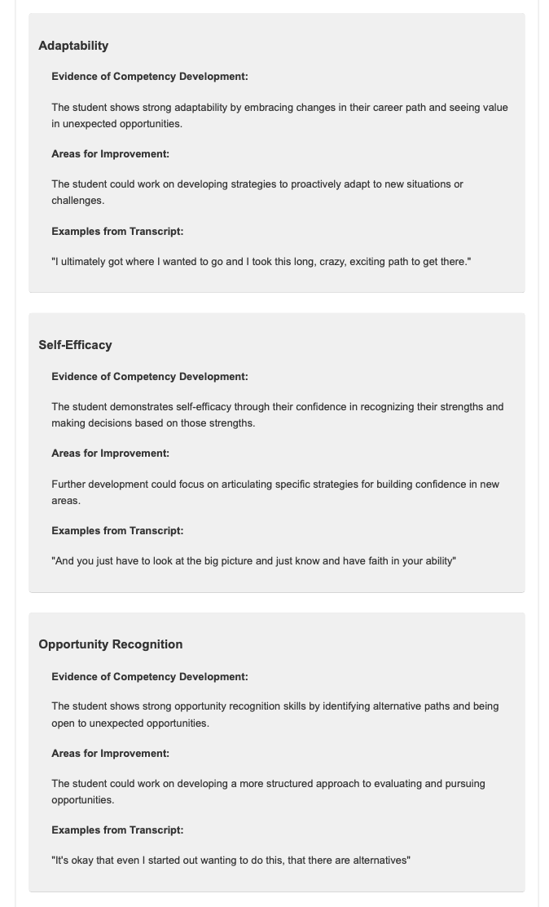

# ZoneSight (Early Prototype)

This early prototype tool extracts student competency insights from audio recordings of presentations, reflections, discussions, meetings, or ANY informal organic conversation. The audio is transcribed, multiple speakers labeled, analyzed for competencies (using deep contextual analysis to pick up nuanced reflection on competencies, NOT key-word based).  Then, a formatted report is generated and saved to the working directory.

## Prerequisites

- Python 3.11.x (tested 3.11.7 on PC and 3.11.10 on Mac, seems fine)
- ffmpeg (for audio file conversion)

## Installation

1. Install ffmpeg:
   - Windows: Download from [ffmpeg.org](https://ffmpeg.org/download.html) and add to system PATH.
   - macOS: Use Homebrew: `brew install ffmpeg`
   - Linux: Use your package manager, e.g., `sudo apt-get install ffmpeg`

2. Clone the repository:
   ```bash
   git clone https://github.com/fizt656/compextractor.git
   cd compextractor
   ```

3. Create and activate a virtual environment:
   ```bash
   python -m venv venv
   source venv/bin/activate  # On Windows use `venv\Scripts\activate`
   ```

4. Install required packages:
   ```bash
   pip install -r requirements.txt
   ```

5. Set up API keys:
   ```bash
   cp .env.example .env
   ```
   Edit `.env` with your API keys.

6. Set up Hugging Face:
   - Create an account at [Hugging Face](https://huggingface.co/)
   - Generate an access token in account settings
   - Add to `.env`: `HUGGING_FACE_TOKEN=your_token_here`
   - Run `huggingface-cli login`
   - Accept terms at https://huggingface.co/pyannote/speaker-diarization
   - Run `copy_model_files.py` in the project directory

## Usage

As ZoneSight is an early prototype, please be aware that the user experience and output may vary. We appreciate your patience and feedback as we continue to improve the tool.

1. Prepare your audio file (MP3, MP4, WAV) and competencies file (text file with definitions).

2. **Important**: Before running the script, make sure to customize the competency file and update the system prompt in `src/main_combined.py` to match your specific needs. See the [Customization](#customization) section for more details.

3. Run the combined script:
   ```bash
   python src/main_combined.py
   ```

4. Enter file names when prompted (audio, competencies, completion sound).

5. Choose the extraction mode (insights, data, or both) when prompted.

6. The script will process the audio and generate a `combined_report.html` file.

7. The report will automatically open in your default web browser.

## Extraction Modes

ZoneSight now offers three extraction modes to cater to different analysis needs:

1. **Insights Mode**: This mode focuses on providing narrative insights about the competencies demonstrated in the audio. It generates a detailed HTML report with qualitative analysis of each competency, including evidence of competency development, areas for improvement, and specific examples from the transcript.

2. **Data Mode**: This mode extracts quantitative data about the competencies. It produces a report with numerical ratings for each competency (on a scale of 0-10), along with specific observations and areas for improvement. The data is presented in both tabular form and as a radar chart for easy visualization.

3. **Both Mode**: This comprehensive mode combines both insights and data, providing a full picture of the competency analysis. The report includes narrative insights, quantitative data, and visualizations, offering a holistic view of the competencies demonstrated in the audio.

When running the script, you'll be prompted to choose one of these modes. The output report will be tailored to the selected mode, ensuring you get the most relevant information for your needs.

## Customization

To adapt ZoneSight to your specific needs:

1. **Competency Definitions**: Create a custom competency file (e.g., `custom_competencies.txt`) with your own competency definitions. Each competency should be on a new line, with its name followed by a colon and a brief description.

2. **Main Script**: Create a custom version of `main_combined.py` (e.g., `custom_main_combined.py`) in the `src` directory. Modify the `extract_competency_insights` function by updating the `prompt` variable to reflect your specific requirements for competency analysis.

3. **System Prompt**: In your custom `main_combined.py`, locate the `extract_competency_insights` function. Modify the `prompt` variable to reflect your specific requirements for competency analysis.

4. **Output Customization**: If needed, you can modify the `generate_combined_report` function in your custom `main_combined.py` to adjust the HTML structure and styling of the output report.

Remember to test your changes thoroughly to ensure they work as expected with your specific use case.

## Combined Narrative and Data Output

The combined output mode, a key feature of this prototype, provides both narrative insights and data visualizations in a single report:

1. **Integrated Analysis**: Generates `combined_report.html` containing:
   - Narrative competency insights for each speaker
   - Radar chart visualizations of competency ratings
   - Overall assessment of competencies

   Here are examples of the output you can expect:

   
   *Figure 2: Detailed competency analysis for a specific skill area*

   
   *Figure 3: Overall assessment of competencies across multiple areas*

   
   *Figure 4: Radar chart visualization of competency ratings*

2. **Multi-Speaker Support**: 
   - Automatically performs diarization to identify different speakers
   - Generates separate insights and charts for each speaker
   - Allows easy comparison across speakers

3. **Consistent Speaker Labeling**: Ensures consistency between narrative and visual parts

4. **Structured Data**: Also generates `competency_data.json` with detailed assessments:
   - Competency ratings (0-10 scale)
   - Specific observations from the transcript
   - Areas for improvement
   - Overall assessment

5. **Interactive Visualizations**: Radar charts for each speaker:
   - Display ratings across all competency dimensions
   - Labeled with speaker tags (e.g., SPEAKER_00, SPEAKER_01)
   - Provide intuitive visual representation of strengths and areas for development

## Example Files and Testing

To help you explore this early prototype, we've included some example files for testing:
- `test.wav`: Short sample audio (individual student)
- `test.txt`: Sample competencies file
- `longer_test.wav`: Longer sample audio (individual student)
- `multi-speaker-discussion.wav`: Sample for testing diarization (group of 6 speakers chatting very naturally and organically about their educational program SOURCE: Full Sail University podcast)

To test:
1. Activate your virtual environment.
2. Run: `python src/main_combined.py`
3. When prompted, enter:
   - Audio file: `test.wav`, `longer_test.wav`, or `multi-speaker-discussion.wav`
   - Competencies file: `test.txt`
   - Sound file: `sound.mp3`
4. Choose the extraction mode (insights, data, or both)

## Additional Features

- **Large File Handling**: Automatically splits large audio files into smaller chunks for processing.
- **Multi-Speaker Support**: Identifies different speakers and provides speaker-specific analysis.
- **Automatic Report Opening**: The generated report automatically opens in your default web browser for immediate viewing.

## Notes and Recommendations

As this is an early prototype, we encourage experimentation and welcome your feedback:

- Customize system prompts in script files to suit specific needs.
- Experiment with different ways of querying the competencies file.
- Change LLMs by editing your environment. Recommended:
  ```
  anthropic/claude-3.5-sonnet
  ```
  or
  ```
  cohere/command-r-plus-08-2024
  ```

## Future Improvements

ZoneSight is continuously evolving. As we refine this prototype, we're considering the following enhancements:

- Batch processing for multiple audio files
- User-friendly GUI
- Improved diarization accuracy
- Enhanced visualization options
- Comparative analysis features for multi-speaker recordings
- Customizable report formats for different stakeholders (various 'insights packages')
- Refined competency extraction algorithms
- Integration with learning management systems
- Real-time analysis capabilities

We value your input in shaping the future of ZoneSight. If you have any ideas or encounter any issues while using this early prototype, please don't hesitate to share your feedback.

Other Ideas? \\m//

## License

This project is licensed under a dual license: MIT License for open-source use and a prohibition on commercial use without explicit permission. Please see the LICENSE file for full details.

## Important Note for Users

Again, to use ZoneSight effectively for your specific needs, you'll need to create two custom files:

1. **Custom Competency File**: Create a text file (e.g., `custom_competencies.txt`) that defines the competencies relevant to your context. This file should follow the format described in the [Customization](#customization) section.

2. **Custom Main Combined Script**: Create a custom version of the `main_combined.py` script (e.g., `custom_main_combined.py`) in the `src` directory. This script should be tailored to your specific analysis requirements, including customized prompts and any additional processing logic you need.

If your organization already uses ZoneSight, you may be able to obtain these custom files from a colleague. Otherwise, you'll need to create them based on your organization's competency framework and analysis needs.
